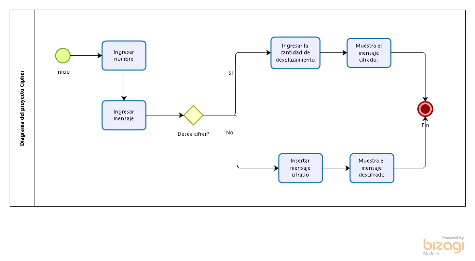

# Riddle Code 
Riddle code es una compañia encargada de brindar seguridad a tus mensajes encriptandolos, para cuidar tu privacidad. 🤗

# De que trata? 😅
En algunas ocasiones la forma en la que nos comunicamos suele ser muy vulnerable, sobre todo si se manejan dispositivos compartidos con otras personas, debido a esto nuestra información se encuentra expuesta a riesgos, perdiendo así su privacidad, por esta razón se ha creado una aplicación con la funcionalidad del cifrado Cesar, en la que se busca comunicarse con otras personas cifrando el mensaje. 

## Cifrado César 🧐

El cifrado césar es una de las técnicas más simples para cifrar un mensaje. Es un tipo de cifrado por sustitución, es decir que cada letra del texto original es reemplazada por otra que se encuentra un número fijo de posiciones (desplazamiento) más adelante en el mismo alfabeto.

Por ejemplo, si usamos un desplazamiento de 3 posiciones:

- La letra A se cifra como D.
- La palabra CASA se cifra como FDVD.
- Alfabeto sin cifrar: A B C D E F G H I J K L M N O P Q R S T U V W X Y Z
- Alfabeto cifrado: D E F G H I J K L M N O P Q R S T U V W X Y Z A B C

## Por que es importante? 🤠

Podrás cifrar un mensaje para ocultar su contenido y así solo tú y la otra persona con quien te comunicas sabrán realmente el significado, evitando de esta forma que tu informacion se encuentre expuesta a riesgos y perdida de privacidad.
Interesante ¿Verdad?🔍

## Sobre la aplicación

           

## Dinámica de la aplicación

### La primera parte:
Se escribe el mensaje que quieres cifrar para después compartir y debajo de ese recuadro te pide que escribas un número que va a indicar el número de desplazamientos que hará la aplicación para cifrar el mensaje.

### La segunda parte:
Se muestra el mensaje ya cifrado, para poder descifrar el mensaje se tiene que copiar el resultado y pegarla en el recuadro. Asimismo, debera insertar la cantidad de desplazamientos que se ingreso al inicio.

### La tercera parte:
Se muestra el mensaje ya descrifrado que de acuerdo a la anterior explicación debe de dar el mensaje original.

